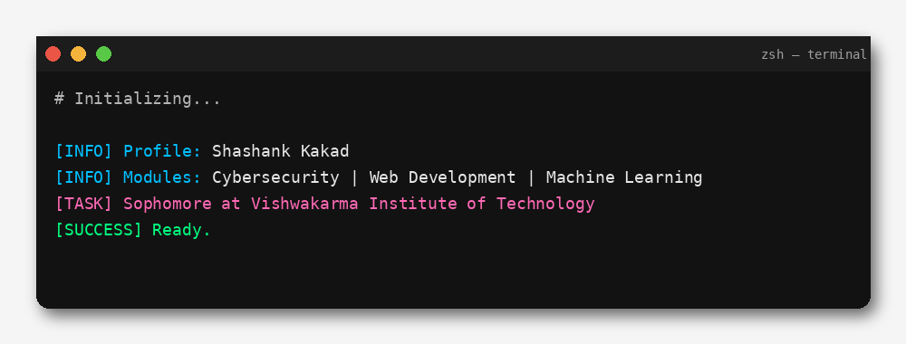

<!-- GitHub Profile README for Shashank Kakad -->

<!-- Terminal Photo -->
<div align="center">
  
</div>

<!-- Divider -->
<p align="center">
  
</p>

---


## 👨‍💻 About Me

→ **Computer Science and Engineering Student**  
→ **Head of Sponsorship** at GeeksforGeeks Student Chapter VIT  
→ **Leetcode** — loading...  
→ **Certifications** — loading...

---
## ⚙️ Technology Stack Overview

| **Category** | **Primary Tools & Frameworks** |
|:--|:--|
| **Programming Languages** |    |
| **AI / Machine Learning** |     |
| **Backend Development** |    |
| **Frontend & Web Stack** |     |
| **Cloud & DevOps** |    |
| **Networking & Security** |    |
| **IoT & Embedded Systems** |    |

---

## 🌐 Connect

<div align="center">

[](https://www.linkedin.com/in/shashank-kakad/)
[](mailto:shashankkakad10@gmail.com)
[](#)

</div>

---

## 🧭 Project Timeline

```mermaid
timeline
  title  System Architecture Evolution and Blueprint

2024 : DDoS Detection System — Cybersecurity & Networking
        : Real-time DDoS detector using Node.js and Google Cloud Run with live traffic logs.

2024 : Sono Lumos Smart Cane — Applied AI & Embedded Systems
        : AI-powered assistive cane using YOLOv8, EasyOCR, and Raspberry Pi with FastAPI.

2025 : EduSense+ — Learning Analytics & Human-Centric AI
        : Emotion-based learning tool tracking engagement and confusion in hybrid classrooms.

2025 (Ongoing): TaskForge — AI-Driven Cyber Defense / Network Intelligence
        : AI framework for network anomaly detection and automated cyber defense.

2026 (Planned): Indian InSite — Socio-Analytical Platform / India-Centric Systems
        : AI platform for public data analytics and governance insights.

2026 (Planned): QuantaNet — Distributed Compute Systems
        : Decentralized GPU/CPU sharing network for secure, token-based distributed computing.

